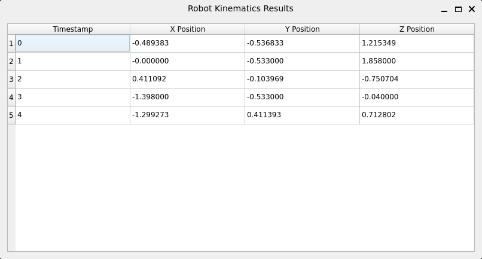

# Клиент для расчета прямой кинематики робота

Python-клиент для взаимодействия с UDP-сервером, расчета прямой кинематики робота и визуализации результатов.

---

## Требования

1. **Операционная система**:
   - Linux (рекомендуется Ubuntu/Debian)
   - Windows Subsystem for Linux (WSL) для Windows
   
2. **ПО**:
   - Python 3.11+
   - Компилятор C (gcc)
   - X-сервер (для WSL)

---

## Установка зависимостей

### 1. Установка системных зависимостей (Linux/WSL)
```bash
sudo apt update && sudo apt upgrade -y
sudo apt install build-essential python3.11 python3-pip -y
```

### 2. Установка виртуального окружения и зависимостей
```bash
cd kinematic_task

# Создание виртуального окружения (рекомендуется)
python3 -m venv venv
source venv/bin/activate

# Установка пакетов
pip install -r requirements.txt
```

## Установка X-сервера:

### 1. Установить X-сервер на Windows:

- Скачайте установщик: https://sourceforge.net/projects/vcxsrv/

- Запустите установку (все параметры по умолчанию)

### 2. После установки VcXsrv:
Настройте параметры:

- "Multiple windows"

- Display number: 0

- "Start no client"

- В дополнительных настройках: Включите "Disable access control"

- Сохраните конфигурацию (по желанию)

### 3. Настройка WSL:
```bash
# Установка GUI-зависимостей
sudo apt install libxcb-xinerama0 libxcb-cursor0 libxcb-icccm4 libxcb-keysyms1 libxcb-render-util0 -y

# Настройка DISPLAY
echo "export DISPLAY=$(grep -m 1 nameserver /etc/resolv.conf | awk '{print \$2}'):0.0" >> ~/.bashrc
source ~/.bashrc
```

## Запуск приложения
 
### 1. Запустить сервер (cервер должен быть запущен до клиента)
```bash
./a.out
```
### 2. Запуск приложения (в отдельном терминале)
```bash
source venv/bin/activate
python client.py
```

### Сервер будет ожидать подключения и выведет сообщения:
 
```bash
Message 1 sent
Message 2 sent
...
Message 5 sent
```

### После запуска клиента откроется графическое окно с таблицей результатов:

</h1>

Timestamp - порядковый номер сообщения от сервера

X, Y, Z Position - рассчитанные координаты конечной точки манипулятора